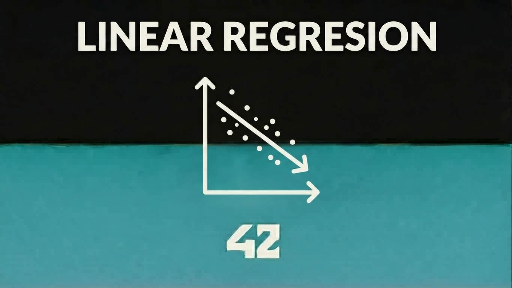
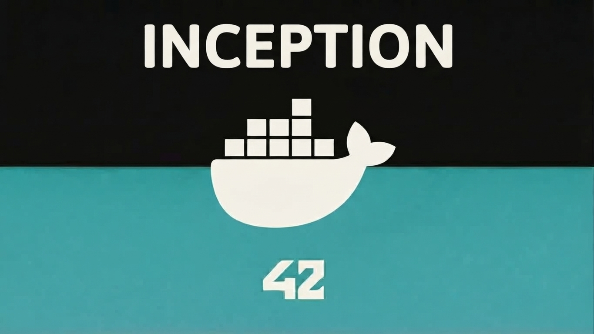
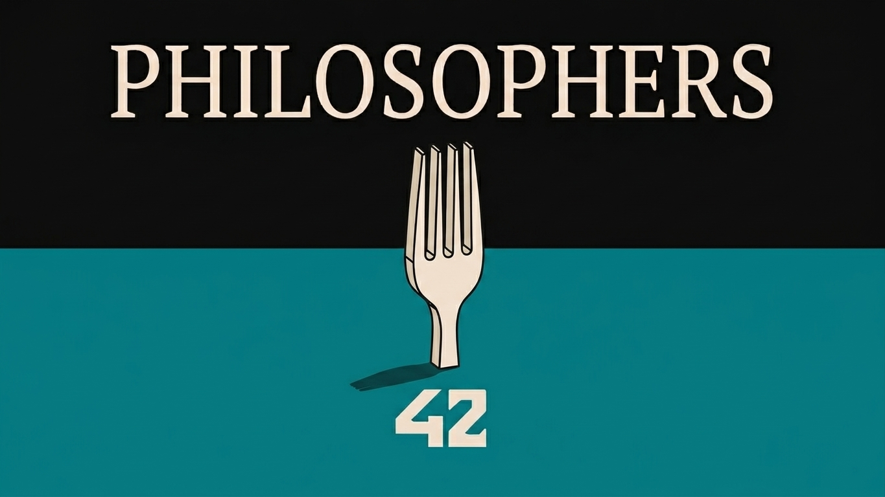
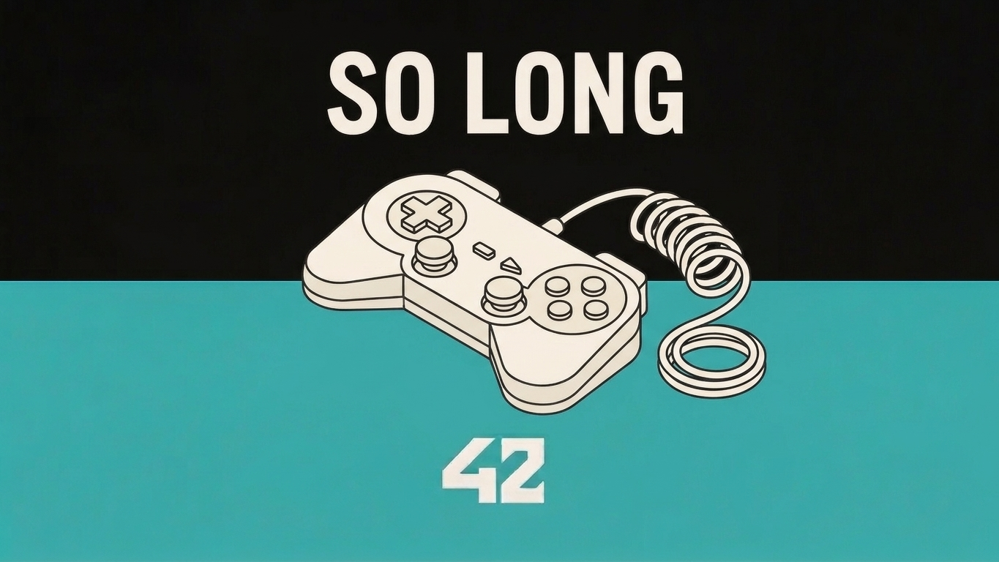
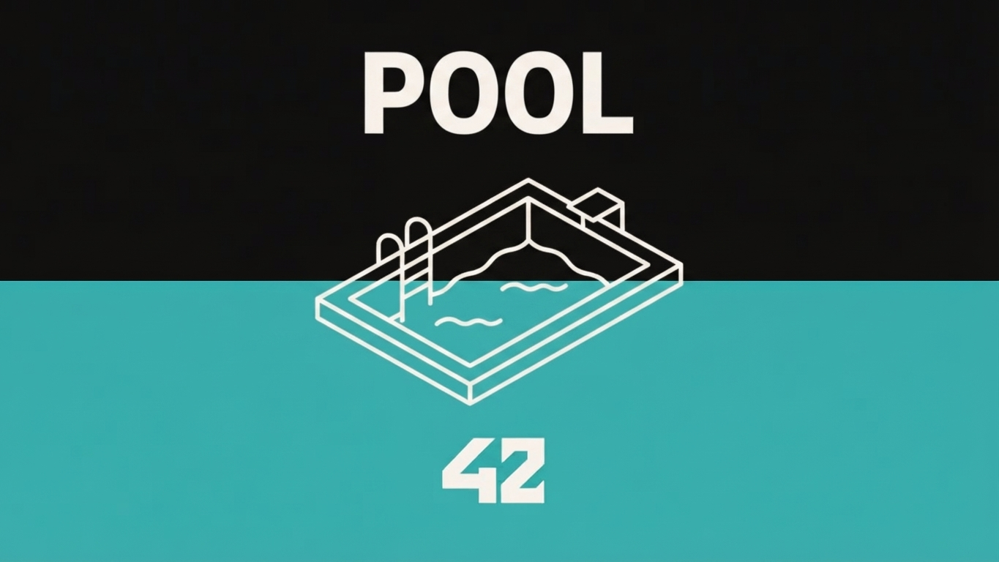

# Mario Picó Busquier

### Full Stack Developer | Python, PHP & Angular | 2 juegos publicados en Steam

---

## Stack Tecnológico

<table>
<tr>
<td><b>Lenguajes</b></td>
<td>

</td>
</tr>
<tr>
<td><b>Frontend</b></td>
<td>

</td>
</tr>
<tr>
<td><b>Backend</b></td>
<td>

</td>
</tr>
<tr>
<td><b>Game Dev</b></td>
<td>

</td>
</tr>
<tr>
<td><b>Herramientas</b></td>
<td>

</td>
</tr>
</table>

---

## Proyectos

<table>
<tr>
<td align="center"></td>
<td align="center"></td>
<td align="center"></td>
<td align="center"></td>
</tr>
<tr>
<td align="center"></td>
<td align="center"></td>
<td align="center"></td>
<td align="center"></td>
</tr>
<tr>
<td align="center"></td>
<td align="center"></td>
<td align="center"></td>
<td align="center"></td>
</tr>
<tr>
<td align="center"></td>
<td align="center"></td>
<td align="center"></td>
<td></td>
</tr>
</table>

---

## Sobre mí

**¿Qué me diferencia?** No soy solo un desarrollador Full Stack. Soy alguien que ha llevado proyectos desde una idea hasta **publicarlos en Steam**, con todo lo que eso implica: código, diseño, despliegue y gestión.

Soy **Lead Developer** en <a href="https://icarusflightgames.com/" target="_blank">Icarus Flight Games</a>, donde lideré el desarrollo de **Circus of the Moon** y **7 Deaths 1 Life**, dos videojuegos publicados en Steam desarrollados en **Python**. Esta experiencia me enseñó a tomar decisiones técnicas bajo presión, coordinar equipos y entregar productos reales que usan personas reales.

Mi formación en **42 Madrid** (el programa de programación más exigente de España, respaldado por Telefónica) me dio una base sólida en algoritmos, estructuras de datos y programación de bajo nivel. Combinado con mi grado en **Desarrollo de Aplicaciones Web** (nota media: **9,3** con matrículas de honor), puedo abordar proyectos complejos de principio a fin.

**Lo que busco:** Un equipo donde pueda aportar mi experiencia en desarrollo full-stack y game development con Python, seguir aprendiendo y construir productos que importen.

- 📍 Alicante, España (disponibilidad para remoto/relocalización)
- 🎓 **Nota media: 9,3** | 3 Matrículas de Honor
- 🎮 **2 juegos publicados en Steam** (desde cero hasta lanzamiento)
- 💻 Estudiante de 42 Madrid (Telefónica) - **Top 1** de la promoción
- 🌐 Inglés B2 | Valenciano B1
- 🟢 **Disponible para incorporaciones inmediatas**

---

## Proyectos Destacados

### 🎮 Circus of the Moon | Videojuego Publicado en Steam

**Lo que hice:** Lideré el desarrollo completo de este videojuego de novela visual psicológica desde la concepción hasta el lanzamiento comercial en Steam.

**Logros clave:**
- 🎯 **12 personajes jugables** con historias ramificadas y múltiples finales
- 💬 Sistema de diálogos ramificados con **más de 50,000 palabras** de contenido narrativo
- 🎨 Gestión de eventos, guardado de progreso y sistema de logros
- 🌐 Web corporativa completa (<a href="https://icarusflightgames.com/" target="_blank">icarusflightgames.com</a>) con SEO optimizado
- 📊 **Coordinación de equipo** de 3 personas: planificación de sprints, revisión de código y control de calidad

**Stack:** Python | Ren'Py | HTML | CSS | JavaScript | Git

---

### 🎮 7 Deaths 1 Life | Videojuego Publicado en Steam

**Lo que hice:** Desarrollo completo de este juego de suspense psicológico con mecánicas narrativas innovadoras.

**Logros clave:**
- 🎯 **8 personajes únicos** con 7 actos interconectados
- 🧩 Sistema de decisiones que afectan la trama y desbloquean finales alternativos
- 🎮 Mecánicas de juego personalizadas más allá del motor Ren'Py
- 🚀 Despliegue y publicación en Steam con integración completa de Steamworks

**Stack:** Python | Ren'Py | Steamworks API | Git

---

### 🎯 Transcendence | Plataforma Web Full-Stack
**Desarrollador Frontend** | Proyecto 42 Madrid | **Nota: 100/100**

**Lo que hice:** Desarrollo de una plataforma web tipo Geometry Dash con interacción en tiempo real entre usuarios.

**Logros clave:**
- ⚡ Comunicación en tiempo real con **WebSockets** (latencia < 50ms)
- 🔐 Sistema de autenticación **JWT + OAuth2** (Google, 42)
- 🗄️ Base de datos PostgreSQL con optimización de consultas
- 🐳 Despliegue con **Docker + docker-compose** para entorno reproducible
- 👥 Sistema de amigos, chat en tiempo real y perfiles de usuario

**Stack:** React | TypeScript | WebSockets | PostgreSQL | JWT + OAuth2 | Docker

---

### 💻 Minishell | Shell Interactiva
**Desarrollador Backend** | Proyecto 42 Madrid | **Nota: 100/100**

**Lo que hice:** Reimplementación completa de una shell tipo Bash desde cero en C.

**Logros clave:**
- 🔧 **7 comandos built-in** implementados desde cero (echo, cd, pwd, export, unset, env, exit)
- 🔗 Soporte completo de **pipes múltiples** y pipelines complejos
- 📁 Redirecciones de E/S (>, <, >>) y **heredoc** (<<)
- 💰 Expansión de variables ($, $?, $$) con manejo de comillas
- ⚡ Operadores lógicos (&&, ||) y gestión de señales (Ctrl+C, Ctrl+D, Ctrl+\)
- 🧹 Gestión de memoria sin leaks (verificado con Valgrind)

**Stack:** C | fork/execve | Pipes | Señales | Gestión de procesos

---

### 🎨 Cub3D | Motor Gráfico 3D
**Desarrollador Backend** | Proyecto 42 Madrid | **Nota: 115/100**

**Lo que hice:** Motor gráfico 3D en tiempo real basado en raycasting, inspirado en Wolfenstein 3D.

**Logros clave:**
- 🎮 Renderizado en tiempo real a **60 FPS** con técnicas de raycasting
- 🖼️ Texturizado de paredes, suelos y techos
- 🎯 Sistema de colisiones y detección de impactos
- 🖱️ Cámara en primera persona con rotación suave
- ⌨️ Gestión de eventos de teclado y ratón

**Stack:** C | MiniLibX | Raycasting | Gráficos por software

---

## Experiencia Profesional

### Desarrollador Principal | Icarus Flight Games
**2025 – 2026** | <a href="https://icarusflightgames.com/" target="_blank">icarusflightgames.com</a>

**Lo que hice:** Lideré el desarrollo de un estudio indie de videojuegos, llevando **2 juegos de cero a Steam**.

**Logros clave:**
- 🎮 Desarrollo completo de **Circus of the Moon** y **7 Deaths 1 Life** con Python
- 👥 **Liderazgo de equipo** de 3 personas: planificación de sprints, daily meetings, code reviews
- 🌐 Diseño y desarrollo de la web corporativa con SEO optimizado (posicionamiento en Google)
- 🚀 Despliegue y publicación en Steam con integración de Steamworks API
- 📈 **Gestión de proyecto** completa: desde el concepto hasta el lanzamiento y marketing

**Stack:** Python | Ren'Py | HTML | CSS | JavaScript | Steamworks API | Git

---

### Desarrollador Web | Goto System Idella S.L.
**2024**

**Lo que hice:** Desarrollo de aplicaciones web empresariales y mantenimiento de sitios corporativos.

**Logros clave:**
- 📦 Aplicación web de gestión de inventario con **PHP (Laravel)** y **JavaScript (jQuery)**
- 🗄️ Optimización de consultas MySQL, reduciendo tiempos de carga en **40%**
- 🌐 Desarrollo de sitios corporativos con **WordPress** y **PrestaShop**
- 🐛 Resolución de incidencias críticas en aplicaciones en producción
- 📊 Mantenimiento y mejora de bases de datos MySQL para CRM

**Stack:** PHP | Laravel | JavaScript | jQuery | MySQL | WordPress | PrestaShop

---

## Formación Académica

### 🎓 42 Madrid (Telefónica) | 2024 – 2026
Programa intensivo de programación en C, C++ y Python. **42 es el programa de programación más exigente de España**, respaldado por Telefónica, con una tasa de aceptación del 5% y un método pedagógico basado en proyectos y aprendizaje entre pares.

**Proyectos completados:** 12 proyectos | **Nota media: 95/100**

### 🎓 Grado Superior en Desarrollo de Aplicaciones Web (DAW)
**IES Juan de Herrera** | 2022 – 2024

- **Nota media: 9,3** (de 10)
- **3 Matrículas de Honor** en Programación, Bases de Datos y Formación Orientación Laboral
- **Top 5%** de la promoción

### 📜 Certificaciones (2024 – 2025)

| Certificación | Institución | Horas |
|---------------|-------------|-------|
| Cloud Computing | Labora | 180h |
| Ciberseguridad | Labora | 180h |
| Java | Udemy | 40h |
| Angular | Udemy | 35h |
| Unity | EOI | 50h |

---

## Contacto

**¿Interesado en colaborar o tienes una oportunidad?** ¡Hablemos!

| Canal | Enlace |
|-------|--------|
| 💼 **LinkedIn** | <a href="https://www.linkedin.com/in/mario-pic%C3%B3-busquier-144442140/" target="_blank">Mario Picó Busquier</a> |
| 🌐 **Icarus Flight Games** | <a href="https://icarusflightgames.com/" target="_blank">icarusflightgames.com</a> |
| 🎮 **Steam** | <a href="https://store.steampowered.com/app/2381570/Circus_of_the_Moon/" target="_blank">Circus of the Moon</a> · <a href="https://store.steampowered.com/app/5033150/7_Deaths_1_Life/" target="_blank">7 Deaths 1 Life</a> |
| 📧 **Email** | <a href="mailto:mario.pico.busquier@gmail.com" target="_blank">mario.pico.busquier@gmail.com</a> |
| 📱 **Teléfono** | +34 662 210 659 |
| 💻 **GitHub** | <a href="https://github.com/Davter17" target="_blank">Davter17</a> |

---

*¿Interesado en colaborar? ¡Hablemos!*

