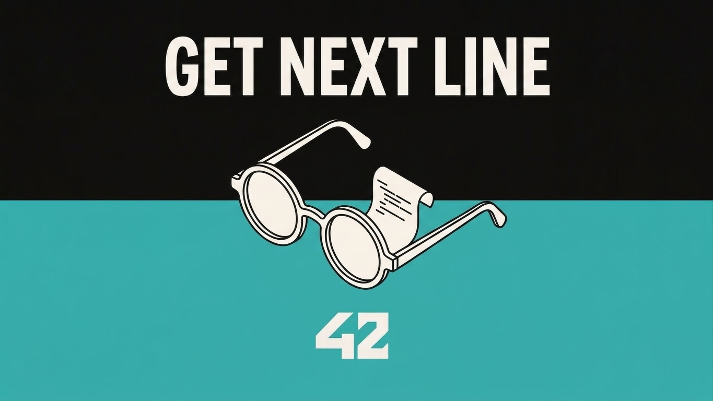
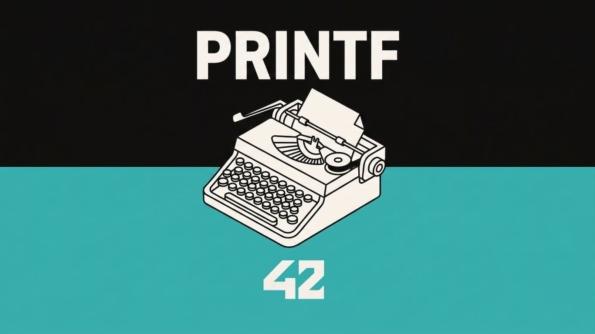
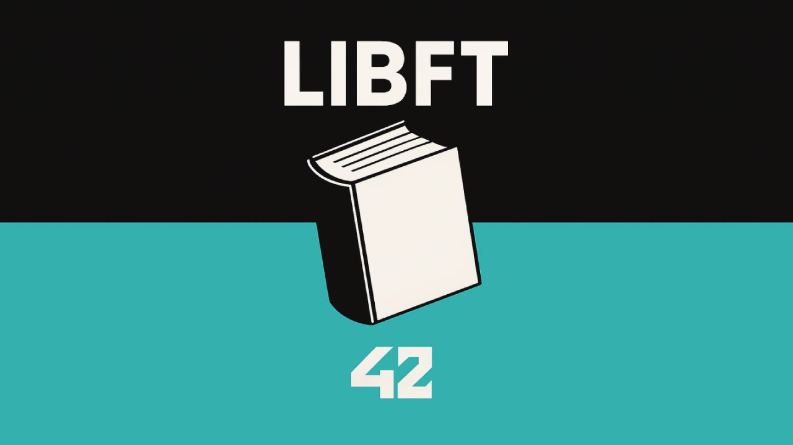

# Mario Picó Busquier

### Full Stack Developer | Game Developer | 42 Madrid

---

## Sobre mí

**Desarrollador Full Stack** especializado en **PHP, Laravel y JavaScript**, con experiencia en desarrollo web y liderazgo de proyectos. Formación en **Desarrollo de Aplicaciones Web** (DAW) y **42 Madrid**, con capacidad para abordar proyectos de principio a fin: desde el diseño y la implementación hasta el despliegue y publicación.

**Fundador y Desarrollador Principal** en [Icarus Flight Games](https://icarusflightgames.com/), estudio independiente de desarrollo de videojuegos donde lideré el desarrollo de **Circus of the Moon**, publicado en Steam. Combino experiencia técnica en desarrollo full-stack con habilidades de liderazgo y gestión de equipos.

- 📍 España
- 🎓 **Nota media: 9,3** | Matrículas de Honor
- 🎮 Game Developer | Juego publicado en Steam
- 💻 Estudiante de 42 Madrid (Telefónica)
- 🌐 Inglés B2 | Valenciano B1

---

## Stack Tecnológico

### Lenguajes

### Frontend

### Backend

### Game Development

### Herramientas & Metodologías

---

## Experiencia Profesional

### Desarrollador Principal | Icarus Flight Games
**2025 – 2026** | [icarusflightgames.com](https://icarusflightgames.com/)

Estudio independiente de desarrollo de videojuegos.

- Desarrollo de **Circus of the Moon**, videojuego completo con Python: lógica de juego, sistema de diálogos ramificados y gestión de eventos
- Liderazgo y coordinación del equipo mediante planificación de tareas, definición de hitos y supervisión de calidad
- Diseño y desarrollo de la web corporativa utilizando HTML, CSS y JavaScript
- Programación en Python para mecánicas, herramientas internas y automatización

---

### Desarrollador Web | Goto System Idella S.L.
**2024**

- Desarrollo de aplicación web de gestión de inventario con **PHP (Laravel)**, **JavaScript (jQuery)** y **MySQL**
- Diseño y mantenimiento de bases de datos MySQL para CRM, optimizando consultas y estructuras
- Desarrollo y mantenimiento de sitios corporativos con **WordPress**, **PrestaShop**, HTML5, CSS3 y JavaScript
- Resolución de incidencias y desarrollo de mejoras funcionales en aplicaciones en producción

---

## Proyectos Destacados

### 🎮 Circus of the Moon | Videojuego Publicado en Steam

Videojuego completo desarrollado con **Python**, incluyendo lógica de juego, sistema de diálogos ramificados y gestión de eventos. Proyecto liderado desde la concepción hasta el lanzamiento comercial en Steam.

---

### 🎯 Transcendence | Plataforma Web Full-Stack
**Desarrollador Frontend** | Proyecto 42 Madrid

Plataforma web inspirada en Geometry Dash, centrada en la interacción en tiempo real.

**Stack:** React | JavaScript | WebSockets | PostgreSQL | JWT + OAuth | Docker + docker-compose

---

### 💻 Minishell | Shell Interactiva
**Desarrollador Backend** | Proyecto 42 Madrid

Shell interactiva inspirada en Bash que reproduce el comportamiento de una terminal Unix.

**Stack:** C | fork/execve | Pipes y redirecciones | Señales | Variables de entorno | Builtins | Gestión de procesos

---

### 🎨 Cub3D | Motor Gráfico 3D
**Desarrollador Backend** | Proyecto 42 Madrid

Motor gráfico 3D en tiempo real basado en técnicas de raycasting, inspirado en Wolfenstein 3D.

**Stack:** C | MiniLibX | Motor de raycasting | Texturizado | Cámara en primera persona | Gestión de eventos

---

## Proyectos en GitHub

<table>
<tr>
<td align="center"></td>
<td align="center"></td>
<td align="center"></td>
<td align="center"></td>
</tr>
</table>

---

## Formación Académica

### 🎓 42 Madrid (Telefónica) | 2024 – 2026
Formación intensiva en programación y desarrollo de software, con especialización práctica en C, C++ y Python.

### 🎓 Grado Superior en Desarrollo de Aplicaciones Web (DAW)
**IES Juan de Herrera** | 2022 – 2024

- **Nota media: 9,3**
- **Matrículas de Honor** en Programación, Bases de Datos y FO

### 📜 Certificaciones (2024 – 2025)

| Certificación | Institución |
|---------------|-------------|
| Cloud Computing | Labora |
| Ciberseguridad | Labora |
| Java | Udemy |
| Angular | Udemy |
| Unity | EOI |

---

## Idiomas

| Idioma | Nivel |
|--------|-------|
| Español | Nativo |
| Inglés | B2 |
| Valenciano | B1 |

---

## Estadísticas de GitHub

---

## Contacto

| Canal | Enlace |
|-------|--------|
| 💼 **LinkedIn** | [Mario Picó Busquier](https://www.linkedin.com/in/mario-pic%C3%B3-busquier-144442140/) |
| 🌐 **Icarus Flight Games** | [icarusflightgames.com](https://icarusflightgames.com/) |
| 🎮 **Steam** | [Circus of the Moon](https://store.steampowered.com/app/2381570/Circus_of_the_Moon/) |
| 📧 **Email** | [mario.pico.busquier@gmail.com](mailto:mario.pico.busquier@gmail.com) |
| 📱 **Teléfono** | +34 662 210 659 |
| 💻 **GitHub** | [Davter17](https://github.com/Davter17) |

---

*¿Interesado en colaborar? ¡Hablemos!*

