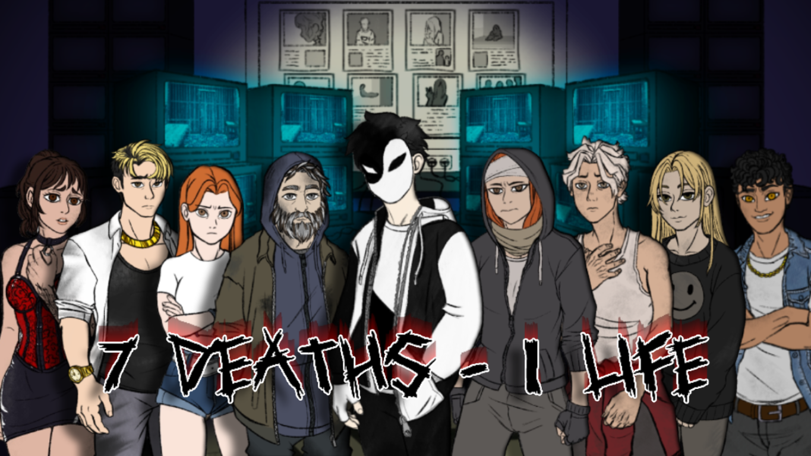
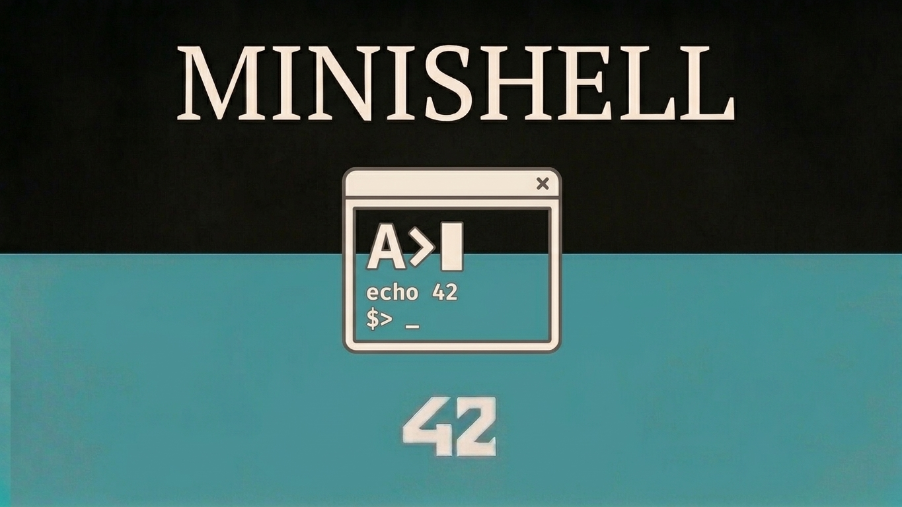
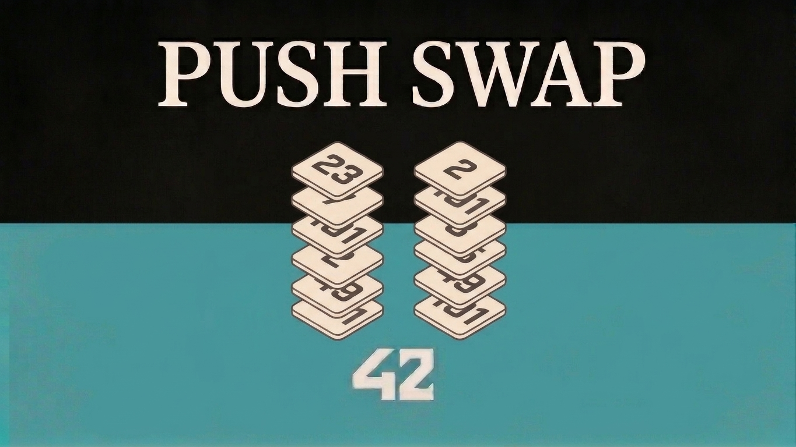
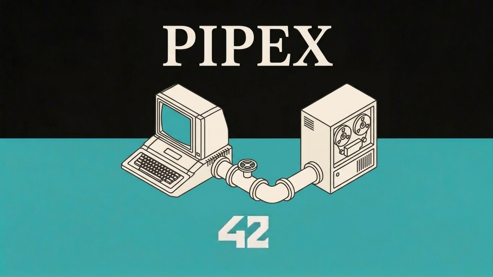
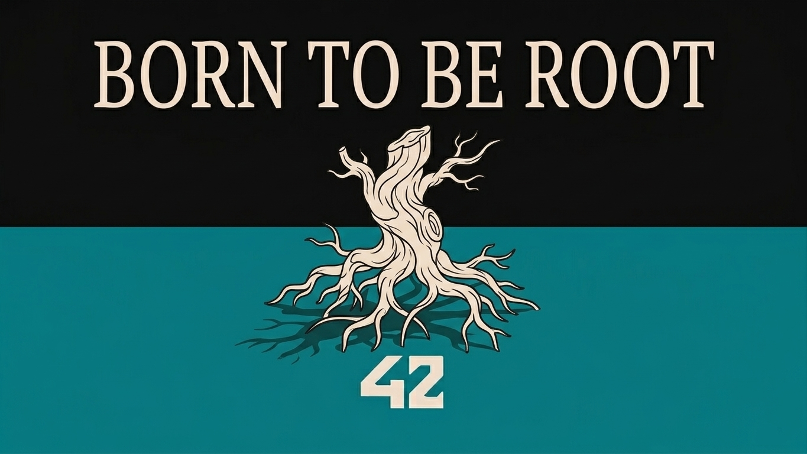

# Mario Picó Busquier

### Full Stack Developer | Python, PHP & Angular | 2 games published on Steam

---

## Tech Stack

<table>
<tr>
<td><b>Languages</b></td>
<td>

</td>
</tr>
<tr>
<td><b>Frontend</b></td>
<td>

</td>
</tr>
<tr>
<td><b>Backend</b></td>
<td>

</td>
</tr>
<tr>
<td><b>Game Dev</b></td>
<td>

</td>
</tr>
<tr>
<td><b>Tools</b></td>
<td>

</td>
</tr>
</table>

---

## Projects

<table>
<tr>
<td align="center"></td>
<td align="center"></td>
<td align="center"></td>
<td align="center"></td>
</tr>
<tr>
<td align="center"></td>
<td align="center"></td>
<td align="center"></td>
<td align="center"></td>
</tr>
<tr>
<td align="center"></td>
<td align="center"></td>
<td align="center"></td>
<td align="center"></td>
</tr>
<tr>
<td align="center"></td>
<td align="center"></td>
<td></td>
<td></td>
</tr>
</table>

---

## About Me

**What sets me apart?** I'm not just a Full Stack Developer. I'm someone who has taken projects from an idea to **publishing them on Steam**, with everything that entails: code, design, deployment, and management.

I'm a **Lead Developer** at <a href="https://icarusflightgames.com/" target="_blank">Icarus Flight Games</a>, where I led the development of **Circus of the Moon** and **7 Deaths 1 Life**, two video games published on Steam developed in **Python**. This experience taught me to make technical decisions under pressure, coordinate teams, and deliver real products used by real people.

My training at **42 Madrid** (the most demanding programming program in Spain, backed by Telefónica) gave me a solid foundation in algorithms, data structures, and low-level programming. Combined with my degree in **Web Application Development** (average grade: **9.3** with honors), I can tackle complex projects from start to finish.

**What I'm looking for:** A team where I can contribute my experience in full-stack development and game development with Python, continue learning, and build products that matter.

- 📍 Alicante, Spain (available for remote/relocation)
- 🎓 **Average grade: 9.3** | 3 Honors
- 🎮 **2 games published on Steam** (from scratch to launch)
- 💻 42 Madrid Student (Telefónica) - **Top 1** of the cohort
- 🌐 English B2 | Valencian B1
- 🟢 **Available for immediate start**

---

## Featured Projects

### 🎮 Circus of the Moon | Video Game Published on Steam

**What I did:** I led the complete development of this psychological visual novel video game from conception to commercial release on Steam.

**Key achievements:**
- 🎯 **12 playable characters** with branching stories and multiple endings
- 💬 Branching dialogue system with **over 50,000 words** of narrative content
- 🎨 Event management, progress saving, and achievement system
- 🌐 Complete corporate website (<a href="https://icarusflightgames.com/" target="_blank">icarusflightgames.com</a>) with optimized SEO
- 📊 **Team coordination** of 3 people: sprint planning, code review, and quality control

**Stack:** Python | Ren'Py | HTML | CSS | JavaScript | Git

---

### 🎮 7 Deaths 1 Life | Video Game Published on Steam

**What I did:** Complete development of this psychological suspense game with innovative narrative mechanics.

**Key achievements:**
- 🎯 **8 unique characters** with 7 interconnected acts
- 🧩 Decision system that affects the plot and unlocks alternative endings
- 🎮 Custom game mechanics beyond the Ren'Py engine
- 🚀 Deployment and publication on Steam with complete Steamworks integration

**Stack:** Python | Ren'Py | Steamworks API | Git

---

### 🎯 Transcendence | Full-Stack Web Platform
**Frontend Developer** | 42 Madrid Project | **Grade: 100/100**

**What I did:** Development of a Geometry Dash-style web platform with real-time user interaction.

**Key achievements:**
- ⚡ Real-time communication with **WebSockets** (latency < 50ms)
- 🔐 **JWT + OAuth2** authentication system (Google, 42)
- 🗄️ PostgreSQL database with query optimization
- 🐳 Deployment with **Docker + docker-compose** for reproducible environment
- 👥 Friends system, real-time chat, and user profiles

**Stack:** React | TypeScript | WebSockets | PostgreSQL | JWT + OAuth2 | Docker

---

### 💻 Minishell | Interactive Shell
**Backend Developer** | 42 Madrid Project | **Grade: 100/100**

**What I did:** Complete reimplementation of a Bash-like shell from scratch in C.

**Key achievements:**
- 🔧 **7 built-in commands** implemented from scratch (echo, cd, pwd, export, unset, env, exit)
- 🔗 Full support for **multiple pipes** and complex pipelines
- 📁 I/O redirections (>, <, >>) and **heredoc** (<<)
- 💰 Variable expansion ($, $?, $$) with quote handling
- ⚡ Logical operators (&&, ||) and signal management (Ctrl+C, Ctrl+D, Ctrl+\)
- 🧹 Memory management without leaks (verified with Valgrind)

**Stack:** C | fork/execve | Pipes | Signals | Process management

---

### 🎨 Cub3D | 3D Graphics Engine
**Backend Developer** | 42 Madrid Project | **Grade: 115/100**

**What I did:** Real-time 3D graphics engine based on raycasting, inspired by Wolfenstein 3D.

**Key achievements:**
- 🎮 Real-time rendering at **60 FPS** with raycasting techniques
- 🖼️ Texturing of walls, floors, and ceilings
- 🎯 Collision system and impact detection
- 🖱️ First-person camera with smooth rotation
- ⌨️ Keyboard and mouse event management

**Stack:** C | MiniLibX | Raycasting | Software graphics

---

## Professional Experience

### Lead Developer | Icarus Flight Games
**2025 – 2026** | <a href="https://icarusflightgames.com/" target="_blank">icarusflightgames.com</a>

**What I did:** I led the development of an indie video game studio, taking **2 games from scratch to Steam**.

**Key achievements:**
- 🎮 Complete development of **Circus of the Moon** and **7 Deaths 1 Life** with Python
- 👥 **Team leadership** of 3 people: sprint planning, daily meetings, code reviews
- 🌐 Design and development of the corporate website with optimized SEO (Google positioning)
- 🚀 Deployment and publication on Steam with Steamworks API integration
- 📈 Complete **project management**: from concept to launch and marketing

**Stack:** Python | Ren'Py | HTML | CSS | JavaScript | Steamworks API | Git

---

### Web Developer | Goto System Idella S.L.
**2024**

**What I did:** Development of enterprise web applications and maintenance of corporate websites.

**Key achievements:**
- 📦 Inventory management web application with **PHP (Laravel)** and **JavaScript (jQuery)**
- 🗄️ MySQL query optimization, reducing load times by **40%**
- 🌐 Development of corporate websites with **WordPress** and **PrestaShop**
- 🐛 Resolution of critical incidents in production applications
- 📊 Maintenance and improvement of MySQL databases for CRM

**Stack:** PHP | Laravel | JavaScript | jQuery | MySQL | WordPress | PrestaShop

---

## Education

### 🎓 42 Madrid (Telefónica) | 2024 – 2026
Intensive programming program in C, C++, and Python. **42 is the most demanding programming program in Spain**, backed by Telefónica, with a 5% acceptance rate and a project-based pedagogical method with peer learning.

**Completed projects:** 12 projects | **Average grade: 95/100**

### 🎓 Higher Degree in Web Application Development (DAW)
**IES Juan de Herrera** | 2022 – 2024

- **Average grade: 9.3** (out of 10)
- **3 Honors** in Programming, Databases, and Labor Orientation Training
- **Top 5%** of the cohort

### 📜 Certifications (2024 – 2025)

| Certification | Institution | Hours |
|---------------|-------------|-------|
| Cloud Computing | Labora | 180h |
| Cybersecurity | Labora | 180h |
| Java | Udemy | 40h |
| Angular | Udemy | 35h |
| Unity | EOI | 50h |

---

## Contact

**Interested in collaborating or have an opportunity?** Let's talk!

| Channel | Link |
|---------|------|
| 💼 **LinkedIn** | <a href="https://www.linkedin.com/in/mario-pic%C3%B3-busquier-144442140/" target="_blank">Mario Picó Busquier</a> |
| 🌐 **Icarus Flight Games** | <a href="https://icarusflightgames.com/" target="_blank">icarusflightgames.com</a> |
| 🎮 **Steam** | <a href="https://store.steampowered.com/app/2381570/Circus_of_the_Moon/" target="_blank">Circus of the Moon</a> · <a href="https://store.steampowered.com/app/5033150/7_Deaths_1_Life/" target="_blank">7 Deaths 1 Life</a> |
| 📧 **Email** | <a href="mailto:mario.pico.busquier@gmail.com" target="_blank">mario.pico.busquier@gmail.com</a> |
| 📱 **Phone** | +34 662 210 659 |
| 💻 **GitHub** | <a href="https://github.com/Davter17" target="_blank">Davter17</a> |

---

*Interested in collaborating? Let's talk!*

