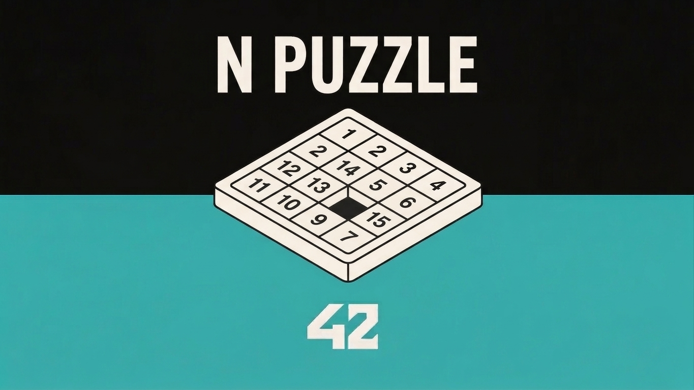
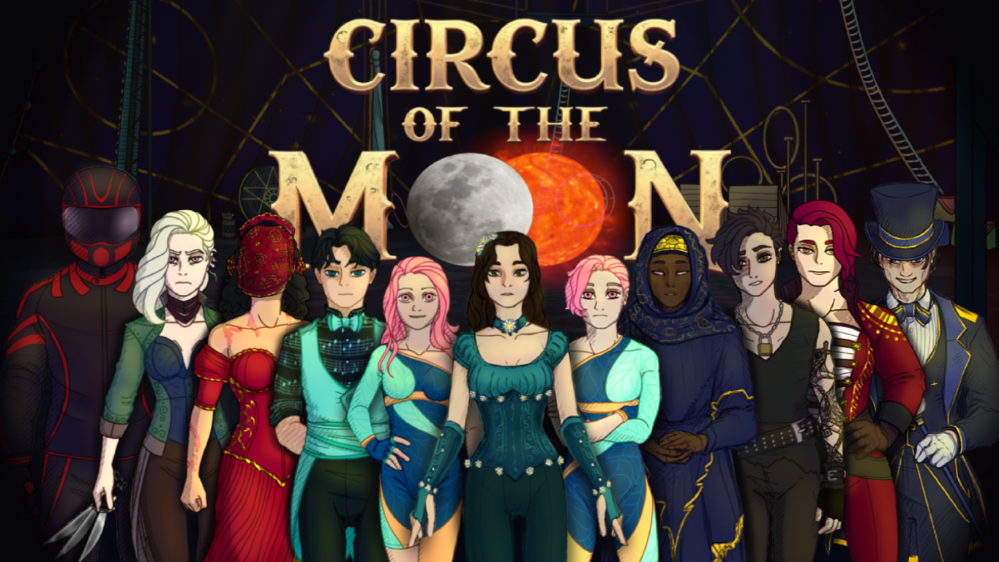

# Mario Picó Busquier

### Full Stack Developer | Game Developer | 42 Madrid

---

## About Me

**Full Stack Developer** specialized in **PHP, Laravel and JavaScript**, with experience in web development and project leadership. Training in **Web Application Development** (DAW) and **42 Madrid**, with the ability to tackle projects from start to finish: from design and implementation to deployment and publication.

**Founder and Lead Developer** at <a href="https://icarusflightgames.com/" target="_blank">Icarus Flight Games</a>, an independent video game development studio where I led the development of **Circus of the Moon** and **7 Deaths 1 Life**, both published on Steam. I combine technical experience in full-stack development with leadership and team management skills.

- 📍 Spain
- 🎓 **Average grade: 9.3** | Honors
- 🎮 Game Developer | 2 games published on Steam
- 💻 42 Madrid Student (Telefónica)
- 🌐 English B2 | Valencian B1

---

## Tech Stack

### Languages

### Frontend

### Backend

### Game Development

### Tools & Methodologies

---

## Projects on GitHub

<table>
<tr>
<td align="center"></td>
<td align="center"></td>
<td align="center"></td>
<td align="center"></td>
</tr>
<tr>
<td align="center"></td>
<td align="center"></td>
<td align="center"></td>
<td align="center"></td>
</tr>
<tr>
<td align="center"></td>
<td align="center"></td>
<td align="center"></td>
<td align="center"></td>
</tr>
</table>

---

## Featured Projects

### 🎮 Circus of the Moon | Video Game Published on Steam

Complete video game developed with **Python**, including game logic, branching dialogue system and event management. Project led from conception to commercial release on Steam.

---

### 🎮 7 Deaths 1 Life | Video Game Published on Steam

Psychological suspense video game developed with **Python**, featuring branching narrative system, 8 characters and 7 acts. A project that takes the narrative experience to the next level with decisions that matter.

---

### 🎯 Transcendence | Full-Stack Web Platform
**Frontend Developer** | 42 Madrid Project

Web platform inspired by Geometry Dash, focused on real-time interaction.

**Stack:** React | JavaScript | WebSockets | PostgreSQL | JWT + OAuth | Docker + docker-compose

---

### 💻 Minishell | Interactive Shell
**Backend Developer** | 42 Madrid Project

Interactive shell inspired by Bash that reproduces the behavior of a Unix terminal.

**Stack:** C | fork/execve | Pipes and redirections | Signals | Environment variables | Builtins | Process management

---

### 🎨 Cub3D | 3D Graphics Engine
**Backend Developer** | 42 Madrid Project

Real-time 3D graphics engine based on raycasting techniques, inspired by Wolfenstein 3D.

**Stack:** C | MiniLibX | Raycasting engine | Texturing | First-person camera | Event management

---

## Professional Experience

### Lead Developer | Icarus Flight Games
**2025 – 2026** | <a href="https://icarusflightgames.com/" target="_blank">icarusflightgames.com</a>

Independent video game development studio.

- Development of **Circus of the Moon** and **7 Deaths 1 Life**, complete video games with Python: game logic, branching dialogue system and event management
- Team leadership and coordination through task planning, milestone definition and quality supervision
- Design and development of the corporate website using HTML, CSS and JavaScript
- Programming in Python for mechanics, internal tools and automation

---

### Web Developer | Goto System Idella S.L.
**2024**

- Development of web application for inventory management with **PHP (Laravel)**, **JavaScript (jQuery)** and **MySQL**
- Design and maintenance of MySQL databases for CRM, optimizing queries and structures
- Development and maintenance of corporate sites with **WordPress**, **PrestaShop**, HTML5, CSS3 and JavaScript
- Incident resolution and functional improvements development in production applications

---

## Education

### 🎓 42 Madrid (Telefónica) | 2024 – 2026
Intensive training in programming and software development, with practical specialization in C, C++ and Python.

### 🎓 Higher Degree in Web Application Development (DAW)
**IES Juan de Herrera** | 2022 – 2024

- **Average grade: 9.3**
- **Honors** in Programming, Databases and FO

### 📜 Certifications (2024 – 2025)

| Certification | Institution |
|---------------|-------------|
| Cloud Computing | Labora |
| Cybersecurity | Labora |
| Java | Udemy |
| Angular | Udemy |
| Unity | EOI |

---

## GitHub Stats

---

## Contact

| Channel | Link |
|---------|------|
| 💼 **LinkedIn** | <a href="https://www.linkedin.com/in/mario-pic%C3%B3-busquier-144442140/" target="_blank">Mario Picó Busquier</a> |
| 🌐 **Icarus Flight Games** | <a href="https://icarusflightgames.com/" target="_blank">icarusflightgames.com</a> |
| 🎮 **Steam** | <a href="https://store.steampowered.com/app/2381570/Circus_of_the_Moon/" target="_blank">Circus of the Moon</a> · <a href="https://store.steampowered.com/app/5033150/7_Deaths_1_Life/" target="_blank">7 Deaths 1 Life</a> |
| 📧 **Email** | <a href="mailto:mario.pico.busquier@gmail.com" target="_blank">mario.pico.busquier@gmail.com</a> |
| 📱 **Phone** | +34 662 210 659 |
| 💻 **GitHub** | <a href="https://github.com/Davter17" target="_blank">Davter17</a> |

---

*Interested in collaborating? Let's talk!*

